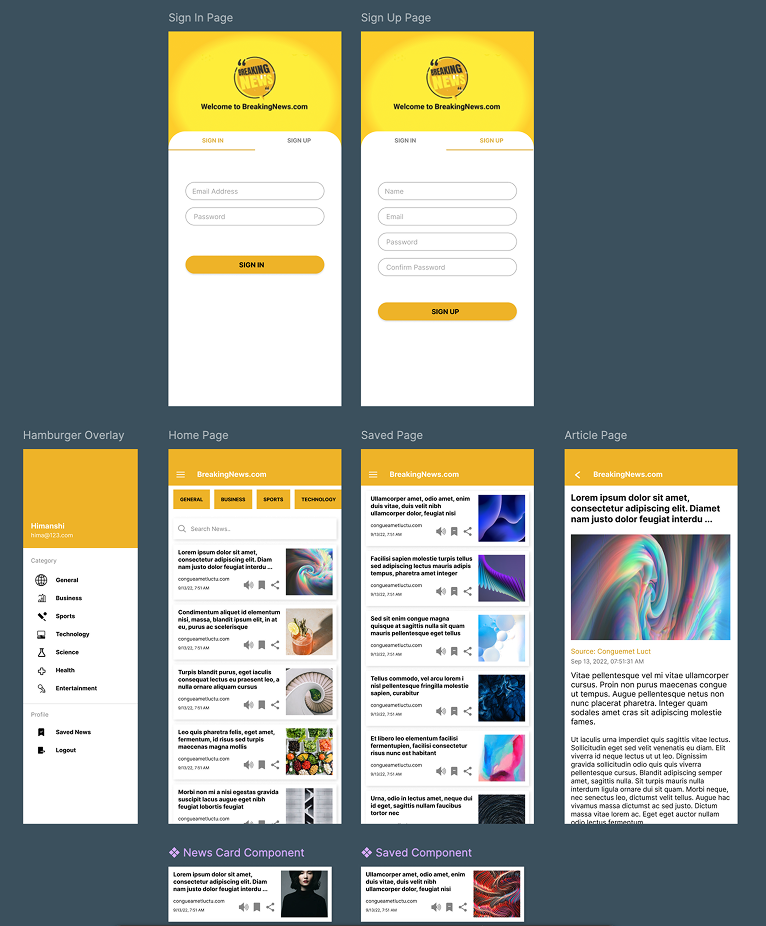

# NewzApp – News App for Android

An Android news app that shows current headlines by category, lets users save articles to their account and share them.

**Tech:** Java, Android SDK, Retrofit, NewsAPI, SQLite, Picasso

**Team:** Group project at the University of Mumbai. **My role:** UI/UX design of the app.

## Design

UI designed in Figma: sign-in and sign-up, home feed with categories, saved articles, article view, navigation menu and reusable news card components. The speaker icon on the cards represents a planned read-aloud feature that was designed but not implemented in the app.

  

## Features

- Headlines by category: Business, Sports, Health, Technology and Science
- User registration and login with session management
- Save articles to a personal reading list (stored locally in SQLite)
- Share articles with other apps
- Article detail view with images

## Setup

1. Open the `NewzApp-v3` folder in Android Studio.
2. Get a free API key from [newsapi.org](https://newsapi.org) and add it as `api_key` in `app/src/main/res/values/strings.xml`.
3. Run the app on an emulator or device (Android 9 or later).
